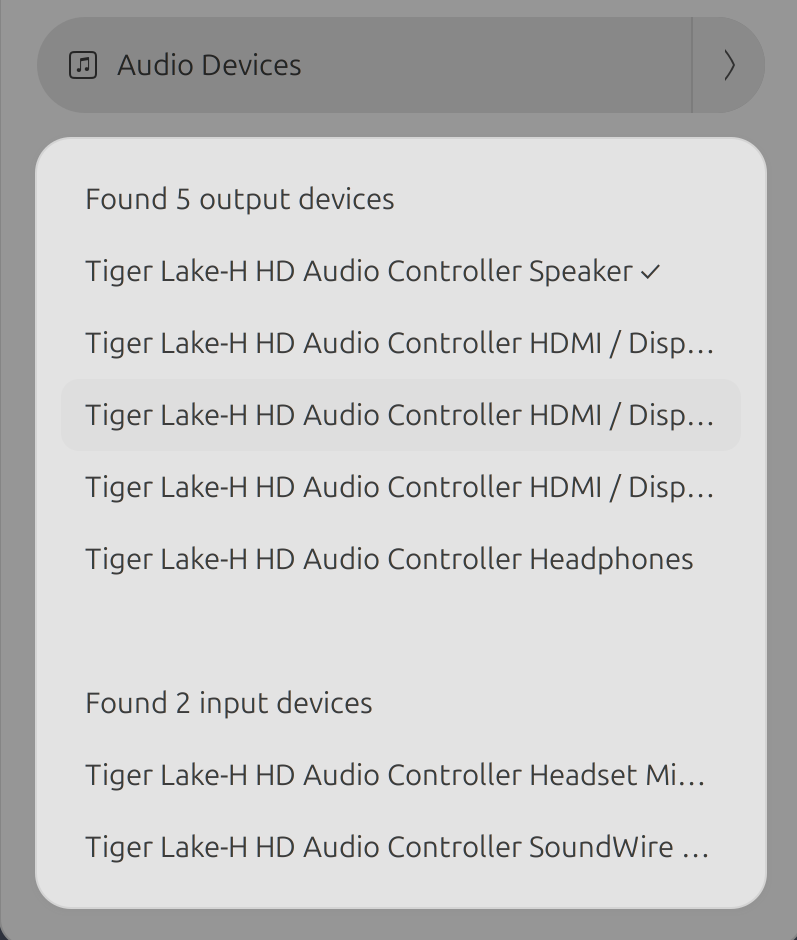

# PulsePick

PulsePick is a minimal GNOME Shell extension that lets you quickly switch audio input/output devices and ports directly from the system volume menu.

It is designed to be simple, fast, and maintainable, without unnecessary features or dependencies.

## Features

- Switch audio output devices (speakers, headphones, HDMI, USB DACs)
- Switch audio input devices (built-in mic, USB microphones)
- Select device ports (e.g. HDMI vs analog)
- Integrated directly into the volume menu
- No panel icons, no clutter
- Event-driven (no polling)
- English and Spanish translations included

## Design Goals

PulsePick intentionally focuses on a narrow scope:

- Minimal UI — only what you need, where you expect it
- Low maintenance — clean code targeting modern GNOME
- Secure by default — no subprocesses, no shell commands, no external helpers
- Future-proof — GNOME Shell 46+ only

If you need per-application routing, profiles, or complex audio management, GNOME’s Settings app remains the right tool.

## Installation

### From GitHub Releases

1. Download the latest `.shell-extension.zip` from [Releases](https://github.com/silentglasses/pulsepick/releases)
2. Install: `gnome-extensions install pulsepick@github.com-silentglasses.shell-extension.zip`
3. Log out and back in (or restart GNOME Shell)
4. Enable: `gnome-extensions enable pulsepick@github.com-silentglasses`

### Manual Installation

```bash path=null start=null
git clone https://github.com/silentglasses/pulsepick.git
cd pulsepick
make install
```

Or manually copy to `~/.local/share/gnome-shell/extensions/pulsepick@github.com-silentglasses/`

## Requirements

- GNOME Shell 46 or newer
- PipeWire (default on modern GNOME systems)

## Internationalization

Translations use standard `gettext` tooling.

Currently supported:

- English
- Spanish

Adding a new language only requires a `.po` file, no code changes.

## Philosophy

- PulsePick avoids workarounds, compatibility layers, and historical baggage in favor of clarity and stability.

## Screenshot




## License

- MIT License
